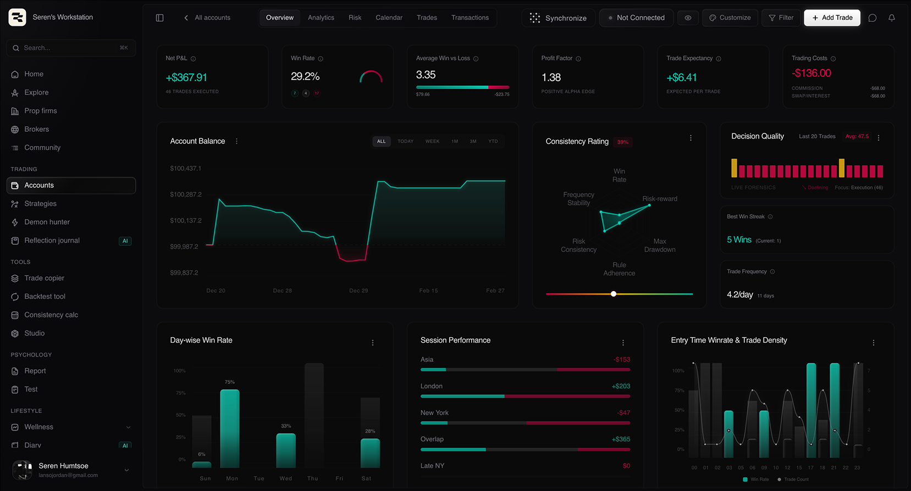

# TradeWorkstation

  
  
<b>Beta V2.1.0</b>

  

## Overview

TradeWorkstation is a high-performance, institutional-grade trading environment designed for clarity, continuous operation, and precise decision-making. Operating seamlessly with MetaTrader 5 (MT5), it bridges the gap between raw trading infrastructure and advanced analytical interfaces.

The system is built on the philosophy that **design expresses system presence through atmosphere, not ornamentation**. Every interface element, data point, and notification is structured to maintain a calm, authoritative environment for the professional trader.

## Core Features

- **Algorithmic & Manual Execution**: Integrated directly with MT5 environments (including Prop Firm accounts like FTMO) for seamless execution and data extraction via dedicated Python workers.
- **Decision Quality Tracking**: Advanced charting and decision quality metrics ensure that every trade is evaluated not just on outcome, but on adherence to execution protocols.
- **Intelligent Notification Center**: Real-time structured updates with markdown support, keeping the trader informed of system states, account changes, and execution logs without demanding unnecessary attention.
- **Ambient System Feedback**: Visual energy is implied through contrast and phase rather than loud ornamentation, establishing visual hierarchy through pure typography and alignment.

## System Architecture

TradeWorkstation operates through a decoupled architecture to ensure maximum reliability:

1. **The Interface (Next.js / React)**
   - A highly optimized, beautifully restrained frontend that visualizes market data and trade execution seamlessly.
   - Built to operate quietly, providing visual completeness and immediate responsiveness.

2. **The Worker Environment (Python / FastAPI / Docker)**
   - Headless background workers connecting directly to robust MetaTrader 5 instances (hosted on secure VPS servers).
   - Responsible for continuous synchronized data extraction, order management, and history syncing.

## Assets & Previews

*Note: Visual previews of the TradeWorkstation interface will be kept in the `assets/` directory.*

- [Current Dashboard View](assets/dashboard-preview.png)
- [Decision Quality Charting](assets/decision-quality.png)
- [Notification Center](assets/notification-center.png)

---

*TradeWorkstation — Quiet performance. Absolute clarity.*
# tradeworkstation-public
